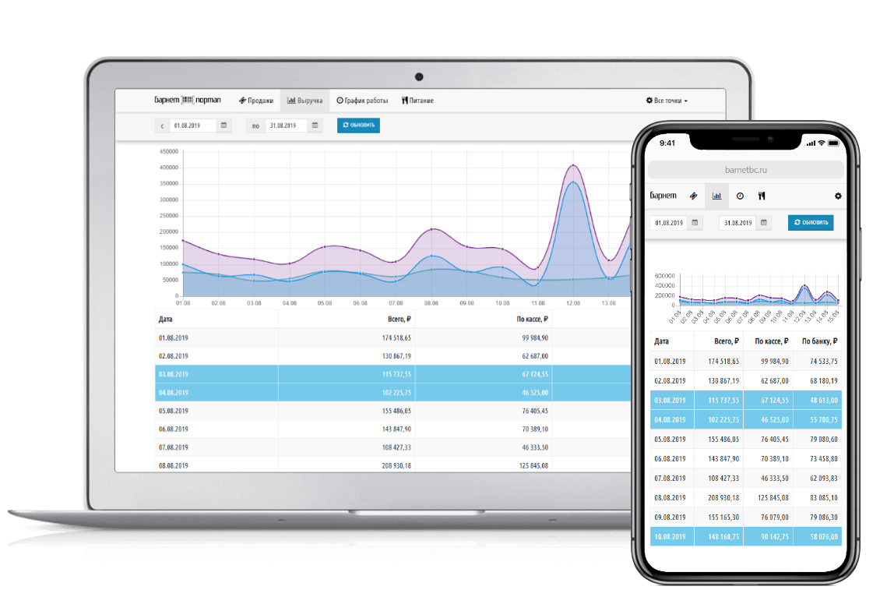
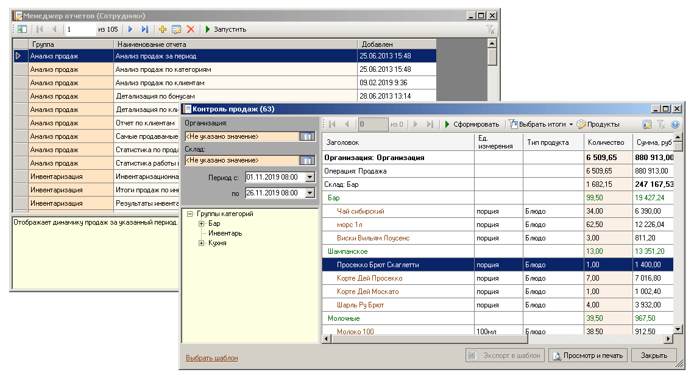

# Техническое задание
Редакция: 2026-01-02

## Цель
Требуется разработать универсальную систему финансового и логистического мониторинга в виде `личного кабинета` клиента.

### Короткое описание
Клиент получает доступ к личному кабинету в виде набора `логин`, `пароль` и входит в личный кабинет. Вход может осуществлятся с **любого
электронного устройства** при наличии сети Интернет: `смартфон`, `планшет`, `персональный компьютер` и **любой операционной** системы.
Клиент попадает на главную страницу (`выручка`) на которой отображается  финансовые результаты за текущую неделю.

Клиент имеет возможность просматривать следующие страницы:
- Продажи
- Выручка
- График работы
- Питание

#### Продажи
_Отдельная страница_ на которой отображаются итоги продаж за указанных период с восможностью различной фильтрации. Товары группируются и фильтруются по следующим полям:
- Организация
- Вид операции
- Группа номенклатуры
- Номенклатура

#### Выручка
_Отдельная страница_ на которой отображаются финансовые итоги в виде сводной таблицы и графика. Данные группируются по дате, наличной оплаты и безналичной оплаты. Выходные и праздничные дни отдельно отмечаются. В табличной части выводятся итоги.

#### График работы
_Отдельная страница_ на которой отображается фактический график работы персонала в виде таблицы с возможностью фильтрации по конкретному сотруднику. В таблице выводится дата начала работы (`регистрация`) и окончание работы. Рассчитывается время работы в часах. Клиент имеет возможность выполнить сортировку по колонкам: `Сотрудник`, `Время работы`

#### Питание
_Отдельная страница_ на которой отображается информация о питании персонала в виде таблицы с итогами по каждому сотруднику. В системе клиент имеет возможнось установить ежедневную сумму на питание. Данная информацию фиксируется в виде отдельного окна с поддержкой истории. В основной таблице отображаются следующие колонки:
- Период 
- ФИО сотрудника
- Сумма
- Сумма выше порога

### Требования
1. Все табличные части приложения необходимо выгружать в следующие форматы:
    - XLS
    - XML
    - CSV
    - JSON
2. Сортировка колонок должна быть гибкой и настраиваемой. Настройки должны задаваться отдельно в виде конфигурационной таблицы в базе данных или настроечного файла для приложения.
3. Данные, которые будут передаваться на сервер должны быть максимально зашифрованы. Обязательно применение защиты трафика (HTTPS). Авторизация должна быть выполнена с использованием [JWT](https://jwt.io/)
4. Необходимо создать три уровня доступа к ресурсам сиcтемы:
    - `Auto` (для различных автоматических сервисов)
    - `Manager` (для сотрудников Клиента). Только просмотр данных
    - `Administrator` (полный доступ)    
5. Данные на сервере должны аккумулироваться только за указанный период, например: **3 месяца**. Данный параметр должен настраиваться. 
6. Необходимо создать систему **управления** клиентами. 
7. Предполагаемый стек: C#, [DotNet 8 (и выше)](https://dotnet.microsoft.com/ru-ru/download), PostgreSQL, [Docker](https://docs.docker.com/engine/install/), Docker-compose, ASP.net, MVC,  [Razor Pages](https://learn.microsoft.com/ru-ru/aspnet/core/razor-pages/?view=aspnetcore-10.0), [Bootstrap](https://bootstrap-4.ru/)

### Прочее
- [Соглашения и рекомендации по разработке](./_docs/CONTRIBUTING.md)
- **Обязательная** структура каталогов:

| Наименование          | Назначение               |
|-----------------------|--------------------------|
| **Core**                  | Основные классы, абстрактные классы и интерфейсы. Перечисление и классы атрибуты. |
| **Logic**                 | Классы, структуры которые реализуют бизнес логику. Статические классы помошники (`Helpers`) |
| **Extensions**            | Статические классы для раширения типового функционала. |
| **Models**                | Классы модели, DTO классы и прочее |

