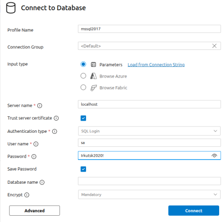
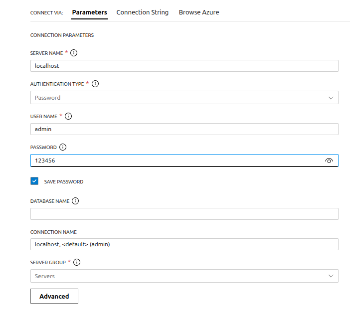

# Настройка окружения

1. Устанавливаем расширения для VSCode
   `ms-ossdata.vscode-pgsql`
   `ms-mssql.mssql`

2. Запускаем докер контейнер
```
sudo docker compose up -d
```

3. Проверяем подключение к Postgre
```
psql -U admin -h localhost -p 5433
```

#### Параметры подключения

- MS SQL



- Postgre


**Порт** 5433

