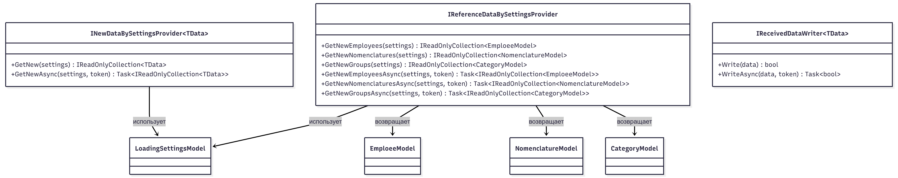
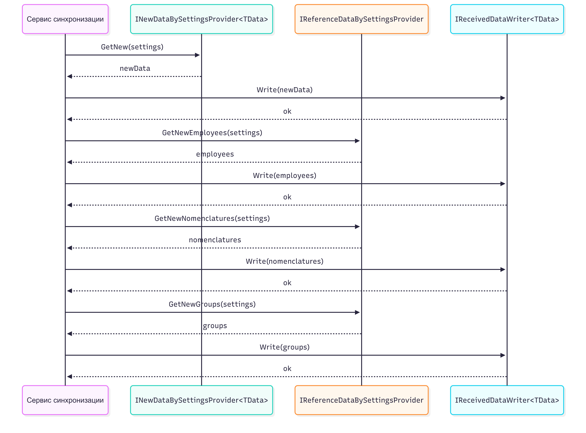

# Техническое описание проекта
Старт проекта: 2026-02-03

### Структура проекта
| №        | Модуль                           | Описание                              |
|----------|----------------------------------|---------------------------------------|
|  1       | PersonalAccount.Domain           | Общий модуль для всего приложения. Включает в себя: `доменные структуры и общие логическое элементы` |
|  2       | PersonalAccount.Console          | Отдельное приложение для запуска на клиента для сборка и передачи данных на сервер. |
|  3       | PersonalAccount.Common           | Общий модуль для хранения интерфейсов и элементов общей логики.
|  4       | PersonalAccount.Data             | Отдельный модуль для работы с данными / миграциями для серверной части. |
|  5       | PersonalAccount.Api              | Отдельный модуль Api для взаимодействия с клиентской частью приложения. |
|          |                                  |                                        |
|          | PersonalAccount.UnitTests        | Только модульные тесты с мокированием. |
|          | PersonalAccount.IntegrationTests | Только интеграционные тесты.           |


#### PersonalAccount.Data
1. Открыть каталог `PersonAccount.Data` в командной строек.
2. Обновить схему
```
dotnet ef dbcontext scaffold "User ID=admin;Password=123456;Host=localhost;Port=5433;Database=personal_account;" Npgsql.EntityFrameworkCore.PostgreSQL --output-dir Models  --force 
```

3. Далее, класс `PersonalAccountContext` переносим в верхний каталог приложения (или переносим изменения).

#### Запуск и отладка
1. Для запуска серверой части (API) необходимо сформировать проект `PersonalAccount.Api` и запустить его. Получим следующее:
```sh
/PersonalAccount.Api 
Beginning database upgrade
Checking whether journal table exists..
Fetching list of already executed scripts.
No new scripts need to be executed - completing.
info: Microsoft.Hosting.Lifetime[14]
      Now listening on: http://0.0.0.0:8000
info: Microsoft.Hosting.Lifetime[0]
      Application started. Press Ctrl+C to shut down.
info: Microsoft.Hosting.Lifetime[0]
      Hosting environment: Production
info: Microsoft.Hosting.Lifetime[0]
      Content root path: /home/valex/Projects/IGU/PersonalAccount2026/Src/PersonalAccount.Api/bin/Debug/net8.0
```

2. Для проверки, в браузере запускаем следующее:
http://localhost:8000/console/14e54725-0efc-42b8-a27d-a84f9a7257c5
Должны получить Json вида
```json
{"owner":{"name":"TEST","inn":"1234567890","address":"г Москва, ул Тестовая, д 1","id":"14e54725-0efc-42b8-a27d-a84f9a7257c5"},"description":"","startPosition":0,"batchSize":10,"id":"00000000-0000-0000-0000-000000000000"}
```

3. Для подготовке к полной загрузке очищаем данные:
```sql
truncate table journal

update companies set load_options = '{"Id": "00000000-0000-0000-0000-000000000000", "Owner": {"Id": "14e54725-0efc-42b8-a27d-a84f9a7257c5", "INN": "1234567890", "Name": "TEST", "Address": "г Москва, ул Тестовая, д 1"}, "BatchSize": 1000, "Description": "", "StartPosition": 0}'

```

4. Далее, в консоле запускаем серверную часть и в VSCode клиентскую часть приложения.
5. Сравнить результат
```sql
-- MS SQL
select  count(*)
        from journal
        where transtype in (387, 386, 211, 216, 101, 102)

-- Postgre
select count(*) from journal
```


## Проектирование интерфейсов инкрементальной загрузки справочников

Добавлены следующие контракты в `Src/PersonalAccount.Common/Core`:

- `INewDataBySettingsProvider<TData>` — универсальное получение набора новых данных по настройкам.
- `IReferenceDataBySettingsProvider` — получение новых сотрудников, номенклатуры и групп по настройкам.
- `IReceivedDataWriter<TData>` — запись полученных данных (синхронно и асинхронно).

### Предполагаемый алгоритм реализации

1. Получить текущие настройки загрузки (`LoadingSettingsModel`) для нужного филиала.
2. На основании настроек (`StartPosition`, `BatchSize`, `Owner`) запросить:
   - новых сотрудников;
   - новую номенклатуру;
   - новые группы.
3. Проверить, что выборки не пустые, и при необходимости выполнить валидацию данных.
4. Передать полученные наборы в реализации `IReceivedDataWriter<TData>` и сохранить их в целевое хранилище.
5. После успешной записи обновить настройки инкрементальной загрузки (новая позиция, время синхронизации, служебные метрики).
6. Вернуть результат синхронизации в вызывающий слой (успех/ошибка).

### UML: диаграмма связей (классов)



### UML: диаграмма последовательности



